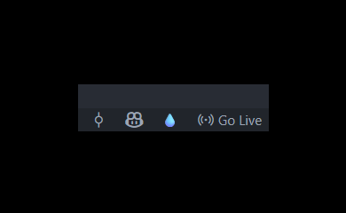
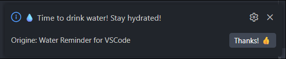
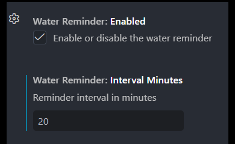

# 💧 Water Reminder

A VS Code extension that reminds you to drink water while coding.

## Screenshots

### Status bar icon

### Notification

### Settings

## Features
- 💧 Water drop icon in the status bar (bottom right)
- Configurable reminder interval (1–480 minutes)
- Enable/disable with one click
- Click the icon to open settings

## Settings
| Setting | Default | Description |
|---|---|---|
| `waterReminder.enabled` | `true` | Enable or disable the reminder |
| `waterReminder.intervalMinutes` | `30` | Reminder interval in minutes |

## Usage
1. After installation, a 💧 icon appears in the bottom right status bar
2. Click the icon to open settings
3. Set your preferred reminder interval
4. Stay hydrated! 🚀

## License
Apache 2.0